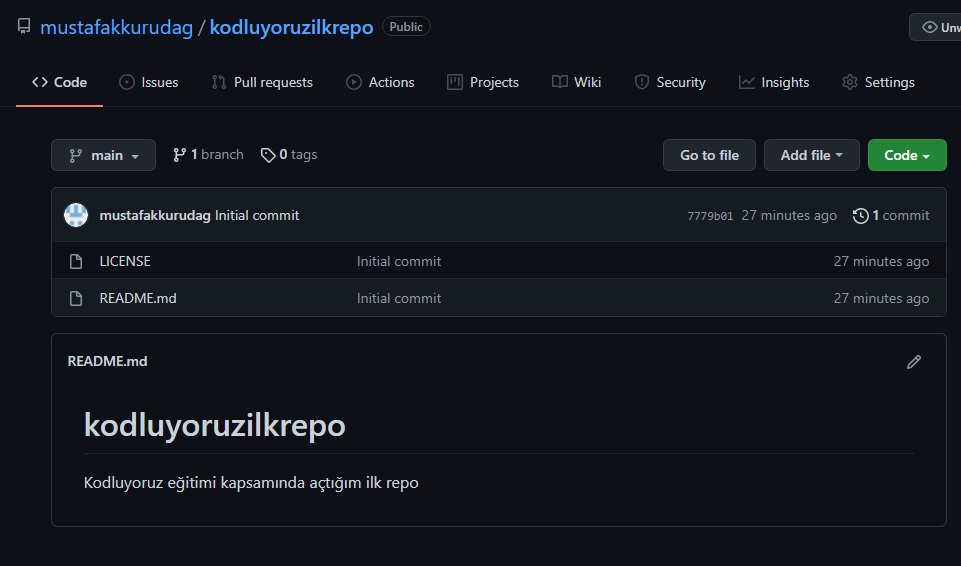

# Kodluyoruz Ilk Repo

Bu repo [Kodluyoruz](http://www.kodluyoruz.org) Front-End eğitiminde oluşturduğumuz ilk repo. İçerisinde bir adet README dosyası, bir adet de index.html barındırıyor. 

> Fotoğraf README.md yazılırken oluşturuldu ve bu esnada index.html henüz oluşturulmamıştı.

# Insallation

Öncelikle projeyi clonelayın. 
> git clone https://github.com/mustafakkurudag/kodluyoruzilkrepo.git

# Usage

Projeyi cloneladıktan sonra Visual Studio Code programında açınız.

Linux için:

> cd kodluyoruzilkrepo   code .

# Contributing

Pull requestler kabul edilir. Büyük değişiklikler için, lütfen önce neyi değiştirmek istediğinizi tartışmak için bir konu açınız.

# License 
[MIT](https://github.com/pagarme/opensource/blob/master/templates/LICENSE.md)
